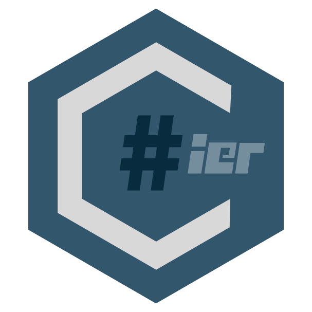
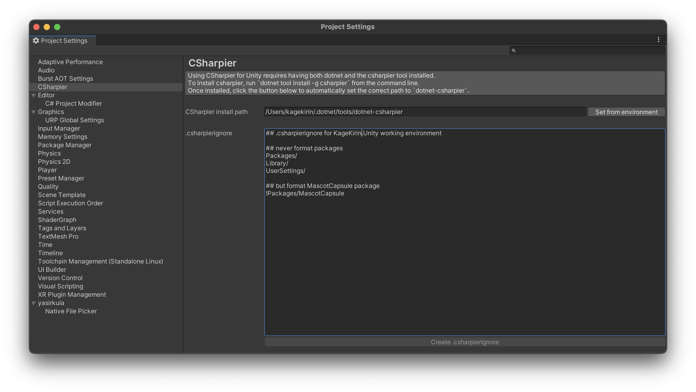

# CSharpier for Unity



A Unity Editor extension to run `dotnet csharpier` on changed C# source files in `/Assets` before compiling them.
C# source files inside the `/Packages` folder are not getting touched, as they might not writable.

## ⚡ Getting Started

[CSharpier for Unity](github.com/KageKirin/UnityCSharpier) requires [CSharpier](https://csharpier.com/) to be installed.

Given a valid .NET installation, this can be done on the command line with:

```sh
dotnet tool install -g csharpier
```

### 🔧 Add OpenUPM registry

The following registry must be added to Unity's `Packages/manifest.json` `.scopedRegistries[]`:

```json
{
    "name": "OpenUPM",
    "url": "https://package.openupm.com",
    "scopes": [
        "com.kagekirin"
    ]
}
```

### 🔨 Add package to project

Add `com.kagekirin.unitycsharpier` to the `Packages/manifest.json` `.dependencies{}`:

```json
"dependencies": {
    "com.kagekirin.unitycsharpier": "1.1.16",
}
```

### ▶ Running and Settings



The only important setting to configure is the execution path for `dotnet-csharpier`,
which can be done automatically in the _Project Settings > CSharpier_ menu.

CSharpier's formatting behaviour can be configured through the following files
located at the root of your Unity project:

* `.csharpierignore`: which defines which files/patterns to ignore (or not ignore)
* `.csharpierrc.yaml`: which defines settings such as characters per line, tab width, and usage of tab character.

NOTE: the `.csharpierignore` displayed in the menu is currently read-only,
in such that changes are **NOT** reflected back to the file.

## 🤝 Collaborate with My Project

Please refer to [COLLABORATION.md](./COLLABORATION.md)
